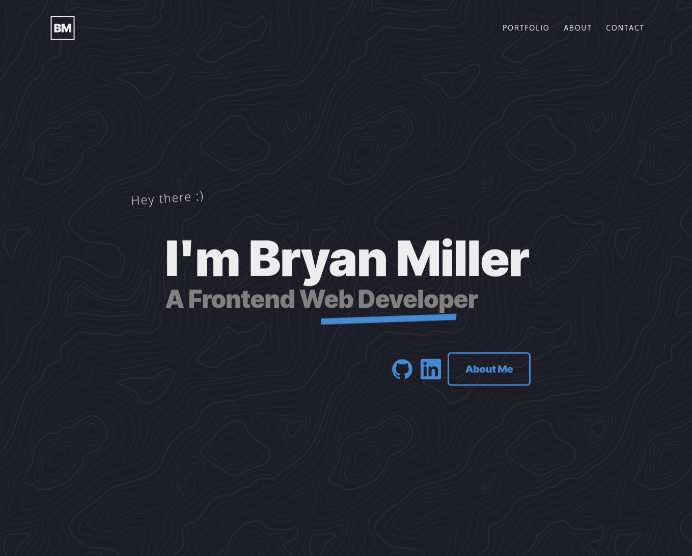

# ErnieJohnson.ca Personal Portfolio

Welcome to Ernie Johnson's Personal Portfolio Project. 
The goal of this repo is to practice the following skill sets:

- **Vite**: React, TypeScript + SWC
- Accessibility (a11y)
  - `aria-label`
  - `aria-labelledby`
  - `aria-hidden`
  - svg `role` and `<title>` attributes
- Advanced HTML & CSS
  - Semantic HTML
    - `section`
    - `header`
    - `footer`
    - `article`
  - Responsive Design
    - media-queries
    - grid & flex
  - Animation & Transitions
    - transform
    - opacity
    - keyframes

## Links

- [Live Demo](http://erniejohnson.ca)
- [On Github](https://github.com/ej8899/portfolio_v2)



## Summary


## SOLID Design


```

## Contact Form: Custom Validation & Async JS

For the contact form, I found a great free API solution called [Web3Forms](https://web3forms.com/). From there, I built out accessible & fully customized validation using React:

- Empty inputs show no error/validation messages
- Focused inputs show validation messages in gray until the requirements are met
- When requirements are met for a focused or unfocused field, the input border turns green
- Unfocused inputs that are invalid show a red border with a descriptive red error message

Elements were initially shifting around whenever a validation message appeared. To get around this, empty validation messages were set to "validated_input" and a class of "invisible" sets the opacity to 0.

The useState hook handles the sending & sent state, letting the user know when their e-mail has completed.

## Screenshots


## Deployment

```sh
# clone repo & change directories
git clone https://github.com/ej8899/portfolio_v2/
cd portfolio_v2

# install all dependencies
npm install

# run app
npm run dev
```
